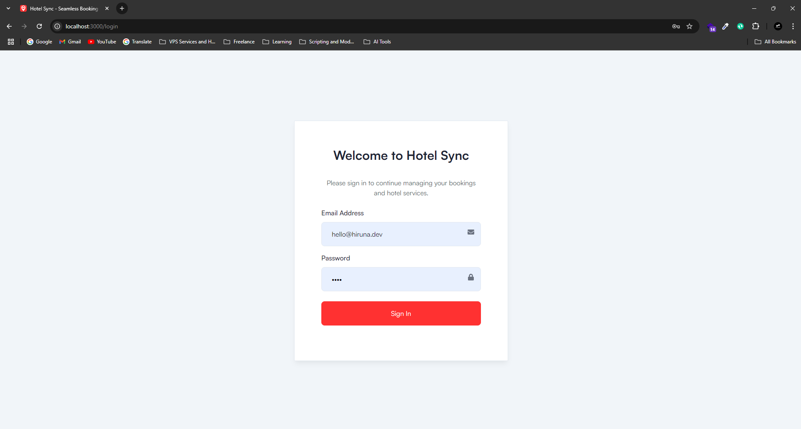
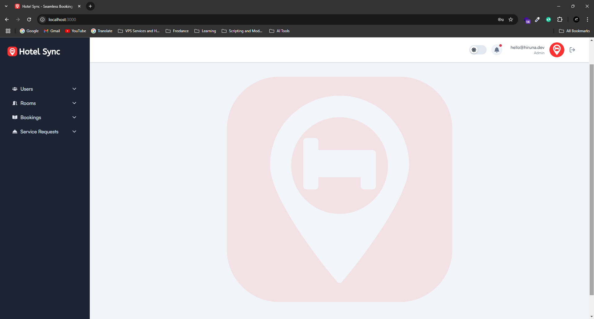
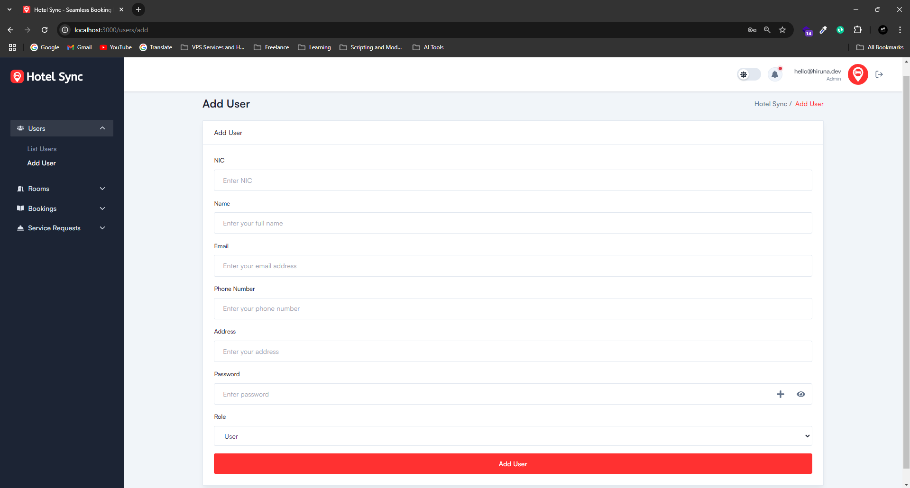
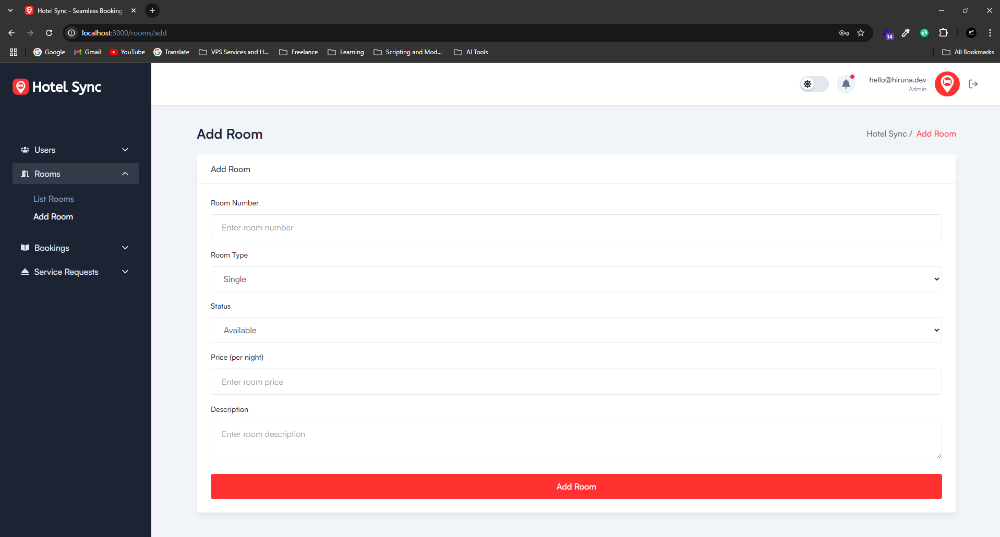
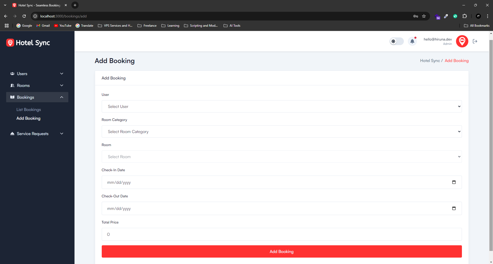
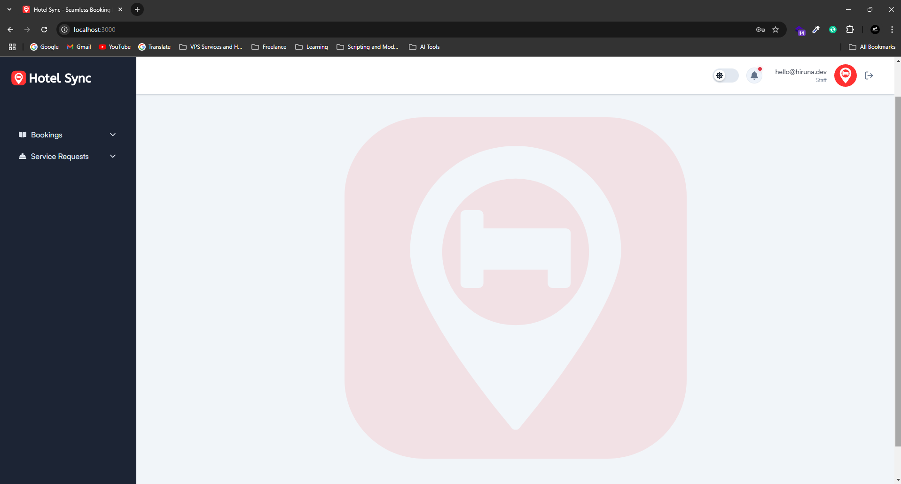
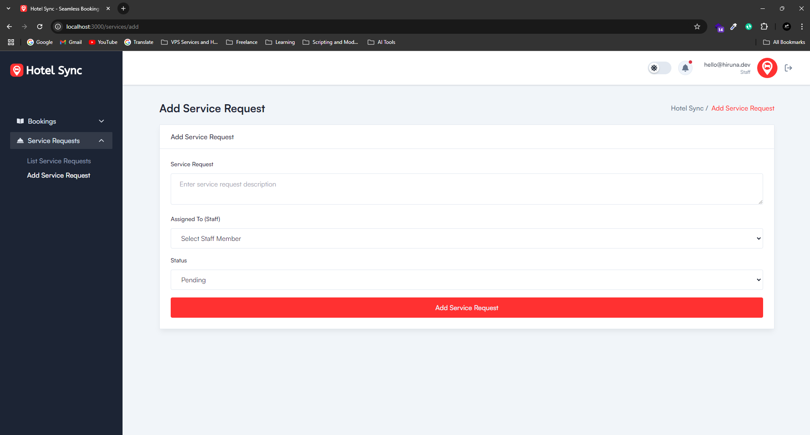
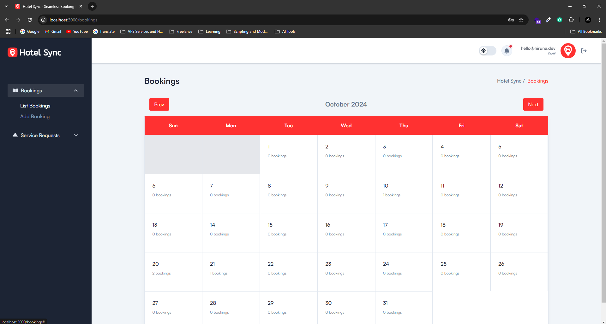
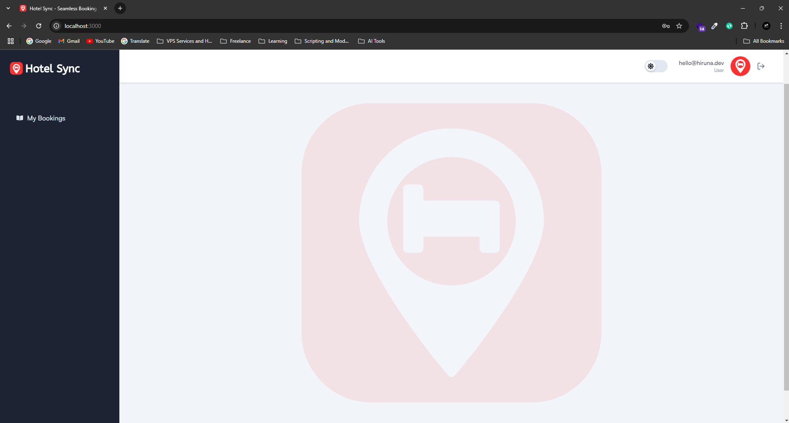
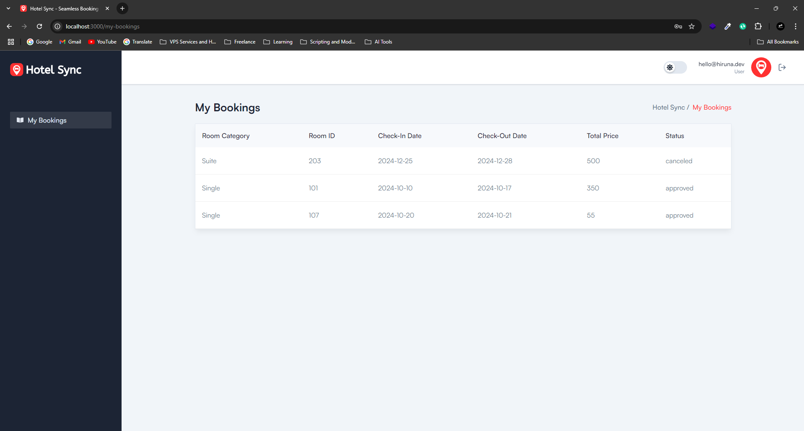

# Hotel Sync - Seamless Hotel Management System


**Hotel Sync** is a microservices-based hotel management platform that simplifies and streamlines hotel operations. It covers key functionalities such as room bookings, user management, service requests, and email notifications. The backend is built with **Ballerina**, while the frontend uses **Next.js**, and **Docker** manages the deployment process. This platform ensures a secure, scalable, and intuitive experience for administrators, staff, and hotel guests, making hotel management more efficient.

## Features

- **Secure Authentication**: Role-based authentication with JWT.
- **Booking Management**: Create, update, and manage room bookings.
- **User Management**: Handle staff and guest accounts securely.
- **Room Management**: Manage hotel rooms, types, and availability.
- **Service Requests**: Manage hotel service requests, assign tasks, and track statuses.
- **Email Notifications**: Automated email system for bookings, updates, and notifications.
- **Role-Based Access**: Separate interfaces for administrators, staff, and hotel guests.

## Project Structure

### Backend (Ballerina)

```plaintext
hotel-sync-backend/
│
├── auth_service/            # Handles authentication, including login and JWT management
├── user_service/            # Manages user-related operations (add, update, delete users)
├── room_service/            # Manages room information (add, update, delete rooms)
├── booking_service/         # Manages booking operations (add, update, view bookings)
├── request_service/         # Handles service requests (add, update, view service requests)
├── email_service/           # Sends email notifications and confirmations
│
├── .env                     # Environment variables configuration
├── Config.toml              # Ballerina-specific configuration file
└── docker-compose.yml       # Docker Compose file to manage all microservices
```

### Frontend (Next.js)
```plaintext
hotel-sync-frontend/
│
├── .next/                   # Compiled output (generated automatically by Next.js)
├── node_modules/            # Dependencies installed via pnpm
├── public/                  # Public assets such as images, icons, etc.
│
├── src/                     # Source code
│   ├── app/                 # Next.js App directory (routes, pages, and layouts)
│   ├── components/          # Reusable React components
│   ├── css/                 # Custom CSS and Tailwind styles
│   ├── fonts/               # Font files used across the app
│   ├── hooks/               # Custom React hooks
│   ├── js/                  # JavaScript utility files
│   └── lib/                 # Libraries and helper functions
│
├── .eslint.rc.json          # ESLint configuration for code linting
├── .gitignore               # Ignored files for version control
├── jsvectormap.d.ts         # TypeScript definitions for Vector Maps
├── next-env.d.ts            # Next.js environment configuration
├── next.config.mjs          # Next.js configuration file
├── package.json             # Project metadata and dependencies
├── pnpm-lock.yaml           # Lock file for package versions (pnpm)
├── postcss.config.js        # PostCSS configuration
├── prettier.config.js       # Prettier configuration for code formatting
├── tailwind.config.ts       # Tailwind CSS configuration file
└── tsconfig.json            # TypeScript configuration file
```

## Technologies Used

- Backend: Ballerina, MySQL, JWT, Docker
- Frontend: Next.js, Tailwind CSS, React, PNPM
- Database: MySQL
- Containerization: Docker, Docker Compose


## How We Used Ballerina

Ballerina was utilized to create various microservices, including:

- **Authentication Service**: Manages user login and authentication using JWT tokens for secure access.
- **User Service**: Handles user management tasks like adding new users, updating information, and removing users.
- **Room Service**: Manages room data, including adding, editing, and deleting room information.
- **Booking Service**: Facilitates room bookings with features for checking availability, making reservations, and updating booking details.
- **Request Service**: Handles service requests, assigning tasks to staff members and tracking the status.
- **Email Service**: Sends automated email notifications for bookings and other updates using SMTP configurations.

Each microservice operates independently, ensuring scalability and maintainability. Ballerina's built-in support for REST APIs, data handling, and easy service integration allowed for seamless communication between services. JWT authentication ensures security across all services.

## Setup Instructions

### Prerequisites

- Docker & Docker Compose
- Node.js & PNPM

### Backend Setup

1. **Clone the Repository**
    ```bash
    git clone https://github.com/hirunaofficial/hotel-sync.git
    cd hotel-sync/hotel-sync-backend
    ```

2. **Configure Environment Variables**
    
    Create a `.env` file in the root of `hotel-sync-backend`:
    ```plaintext
    MYSQL_ROOT_PASSWORD=yourpassword
    MYSQL_DATABASE=hotel_sync_db
    PMA_HOST=mysql
    PMA_USER=root
    PMA_PASSWORD=yourpassword
    ```

3. **Docker Compose Up**
    ```bash
    docker-compose up --build
    ```

### Frontend Setup

1. **Navigate to Frontend Directory**
    ```bash
    cd hotel-sync-frontend
    ```

2. **Install Dependencies**
    ```bash
    pnpm install
    ```

3. **Run the Application**
    ```bash
    pnpm dev
    ```

### Running the Application

- **Backend**: The backend services will be available on various ports as specified in the `docker-compose.yml` file.
- **Frontend**: The frontend application will be accessible at `http://localhost:3000`.

## Screenshots

### **Login**  
  

### Admin Interface
**Admin Dashboard**  
  
  
#### **Add Users**  
  
  
#### **Add Rooms**  
  
  
#### **Add Bookings**  
  

### Staff Interface
#### **Staff Dashboard**  
  
  
#### **Add Service Request**  
  
  
#### **Bookings**  
  

### User Interface
#### **User Dashboard**  
  
  
#### **My Bookings**  
  

## License

This project is licensed under the GPL-3.0 License. See the LICENSE file for details.

### Contact

- Author: Hiruna Gallage
- Website: [hiruna.dev](https://hiruna.dev)
- Email: [hello@hiruna.dev](mailto:hello@hiruna.dev)